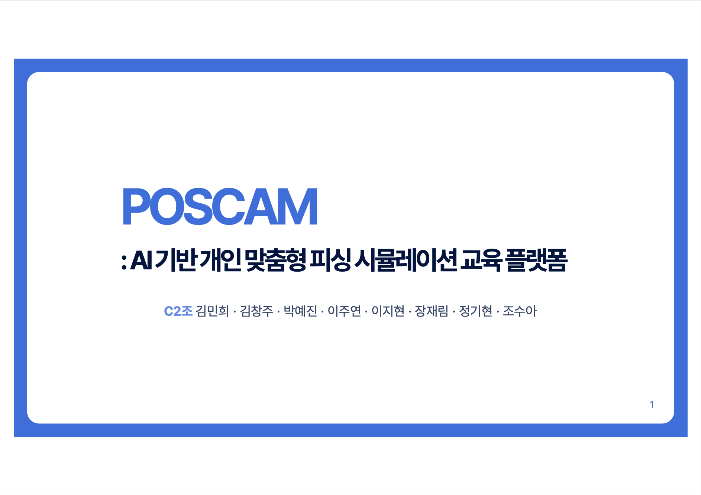

# POSCAM

**AI 기반 개인 맞춤형 보이스피싱 시뮬레이션 교육 플랫폼**

> 예방은 경고가 아닌, 경험에서 시작됩니다.

이 저장소는 POSCAM 프로젝트의 **발표자료(연구·설계 문서)** 를 공개합니다.
서비스 소스코드는 주제 특성상 공개하지 않습니다.

### 📊 Project Presentation

[](docs/POSCAM_Presentation.pdf)

> 💡 **위 이미지를 클릭**하시면 전체 PDF 발표 자료(40p)를 확인하실 수 있습니다.

---

## 1. 프로젝트 개요

### 배경

| 문제 | 근거 |
|---|---|
| 피싱 피해 증가 | 전체 보이스피싱 피해액 4,472억(2022) → 10,566억(2025.1~10), 약 2.4배 상승 |
| 피해 이후 후유증 | 피해금 미회수 93%, 우울·수면장애 경험 90% |
| 효과 없는 예방교육 | 영상 교육 후 피싱률 변화 없음 / 참여형 교육은 피싱률 40% 감소 |

이론 교육을 넘어 **실제 대응 훈련**이 필요하다는 문제의식에서 출발했습니다.

### 선행 조사

- 기존 사례는 실시간 **탐지·대응 도구**이거나 **이론 강의**로, 개인 맞춤형 체험 교육은 부재
- LLM 기반 개인 맞춤형 훈련은 기존 교육자료 대비 사후평가 점수 우위 (4.97 vs 4.04)
- 선행 연구 VishBox는 텍스트 전용으로 **'음성 없는' 한계**

→ **LLM 기반 개인 맞춤형 교육 + 실제 음성 기반 몰입형 시뮬레이션**

### 목표

개인 맞춤형 시나리오 생성 · 실제와 같은 음성 체험 · 취약점 분석 리포트를 통해
사용자의 보이스피싱 **대응력과 경계심**을 실질적으로 향상시킵니다.

---

## 2. 시스템 구성

```
사용자 정보 입력
      │
      ▼
[1] 피싱 유형 추천        LLM 기반 대분류·소분류 적합도 검사
      │
      ▼
[2] 시나리오 생성 Agent   사용자 분석 → 배경 설정 → 공격 흐름 설계 → 검수·교정
      │
      ▼
[3] 실시간 음성 대화      VAD/STT ─ 대화 LLM ─ TTS 루프
      │                   종료 조건: 거부 2연속 · 시간 초과 · 목표 달성
      ▼
[4] Report Agent          대응 행동 분류 → 맞춤 코칭 리포트
```

### 기능 1 — 개인 취약점 분석 기반 피싱 유형 추천

경찰청 「월간 피싱웹진」, 금융감독원 「바로 이 목소리」에서 **피싱 사례 200건**을 발췌·분석해
키워드를 추출하고 유형 DB를 구축했습니다.

- **대분류 8종**: 금융 · 취업알선 · 검찰사칭 · 주택계약 · 정부지원금 · 가족사칭 · 보험 · 세관
- **소분류**: 대분류별 4개 세부 유형

사용자 정보(연령대·성별·취업 여부·대출 여부·제2금융권 이용 여부·디지털 금융 이해도 등)를 입력받아
LLM이 대분류/소분류 적합도를 검사하고, **추천 사유와 함께** 최종 시나리오 유형을 제시합니다.

### 기능 2 — 추천 유형 기반 모의 피싱 시나리오 생성

사용자 프로필과 추천 유형을 입력으로 받아 LLM이 시나리오를 설계합니다.

`사용자 분석` → `배경 설정` → `핵심 탈취 정보 설계` → `공격 흐름(접촉 → 신뢰 → 압박 → 탈취)`

출력물은 실시간 대화 LLM의 시나리오 프롬프트로 전달됩니다.

### 기능 3 — 실시간 전화 피싱 시뮬레이션

```
사용자 발화 ─▶ VAD/STT ─▶ 대화 LLM(가칭 피싱범 Agent) ─▶ TTS ─▶ 음성 출력
                  ▲                                                │
                  └────────────────────────────────────────────────┘
```

사용자의 반응에 따라 다음 발화 전략이 동적으로 변합니다.
(예: `의심 표현 감지 = TRUE` → `다음 전략 = 설득 강화·신뢰 확보` → 다음 답변 생성)

### 기능 4 — 체험 결과 기반 맞춤 리포트

통화 반응을 분석해 대응 유형을 판정하고(예: **검증형** — 공식 채널 검증 수행, 개인정보 유출 없음, 위험 행동 0건),
사용자 프로필과 대화 기록을 근거로 시나리오 유형 · 대응 유형 · 통화 분석 · 개선점 · 행동 수칙을 담은 리포트를 제공합니다.

- 통화 반응 분석: `Claude Haiku 4.5`
- 맞춤 리포트 생성: `GPT-4.1-mini`

---

## 3. 모델 선정

### 시나리오 생성 LLM

금융감독원 '그놈 목소리' 수사기관 사칭형 공개 음원을 전사·화자 분리해,
**설계용 79건 / 평가용 24건**으로 분리했습니다. 평가용은 프롬프트 설계에 사용하지 않았습니다.

설계용 통화의 고신뢰 발화 4,027개에서 **7개 행동 축**을 도출하고,
축 조합을 달리한 공통 평가 프롬프트 24개를 모든 모델에 동일하게 제공했습니다.

**종합 유사성 지수 = (의미 유사성 + 전술 구성 유사성 + 흐름 유사성) ÷ 3**

| 평가 항목 | GPT-5.4-mini | Claude Haiku 4.5 | Claude Sonnet 4.5 | Smoothie-Qwen3-8B (8bit) |
|---|---|---|---|---|
| 종합 유사성 지수 | 8.69 | 8.34 | **9.12** | 3.77 |
| 유효 출력 | **24/24 (100%)** | 19/24 (79.2%) | 20/24 (83.3%) | 13/24 (54.2%) |
| 평균 생성시간 | **6.8초** | 15.4초 | 37.6초 | 298.2초 |
| 실측 비용/시도 | **$0.0039** | $0.0109 | $0.0345 | API 비용 없음 |

→ **GPT-5.4-mini 선정.** 24건 모두 유효 · 평균 6.8초 · 최저 실측 API 비용을 동시에 충족.

> 종합 유사성 지수는 정확도나 백분율이 아닌 상대 비교 지표입니다.

### 음성 파이프라인 (STT / VAD / TTS)

측정 규모 **51,280건** (정제 24,000 + 소음 17,280 + 저품질 4,800 + 숫자 3,200 + 노인 2,000, 2 VAD × 4 STT 조합)

| 단계 | 핵심 지표 | 비교 | 선정 |
|---|---|---|---|
| STT | 처리 지연 시간 | turbo 0.19s / large-v3 0.35s / turbo-korean 문장 뭉개짐 / SenseVoice 숫자 부정확 | **faster-whisper large-v3-turbo** |
| VAD | 환각률 | Silero 3% / TEN 28% / webrtc 82% / 무VAD 90% | **Silero VAD** |
| TTS | TTFB · 실재감 | ElevenLabs 0.46s / Typecast 0.41s / Supertone 1.11s | **ElevenLabs Turbo v2.5** |

---

## 4. 검증

사전/사후 설문(인식·유형·대응·판별 영역)과 지식 퀴즈, 피싱 통화 판별 테스트를 진행했습니다.

| 측정 영역 | 사전 | 사후 |
|---|---|---|
| 경각심 | 4.01 | 4.27 |
| 수법 인지도 | 2.94 | 3.80 |
| 대처 효능감 | 3.68 | 4.13 |
| 채용사칭 특화 | 3.04 | 3.95 |

지식 퀴즈 정답률과 피싱 통화 판별 정답률 모두 체험 후 상승했습니다. (리커트 5점 평균)

---

## 5. 기대효과와 한계

**기대효과**

- 위험 신호 조기 인지를 통한 보이스피싱 발생 건수·피해액 감소
- 실제 상황에서 침착하게 대처하는 자기효능감 향상
- 피싱 취약군의 피해 사각지대 축소
- 불신이 아닌 분별로 — 정상 금융·통신 이용 회복
- 신고·수사 등 사회적 대응 비용 절감

**한계**

- **기술의 한계** — 소음 환경 환각·숫자 오독 등 STT 인식 한계, TTS 외부 API 의존
- **진화하는 수법과의 시차** — 딥페이크·딥보이스 등 신종 AI 사기에는 아직 미대응

---

## 6. 데이터 출처

- 공공데이터포털 — 경찰청 보이스피싱 현황
- 경찰청 「월간 피싱웹진」
- 금융감독원 「바로 이 목소리」, 보이스피싱 체험관 '그놈 목소리' 공개 음원
- Ho et al., *IEEE S&P 2025* (UC San Diego Health)
- Kumaraguru et al., *School of Phish*, SOUPS 2009

---

## 7. 팀

**C2조** — 김민희 · 김창주 · 박예진 · 이주연 · 이지현 · 장재림 · 정기현 · 조수아

## Contact

- Mini Kim - mini.mh.kim@gmail.com

---

## 목적 및 범위

POSCAM은 **보이스피싱 예방 교육**을 목적으로 하는 방어적 보안 프로젝트입니다.
본 저장소는 연구·설계 과정을 기록한 발표자료만을 포함하며,
시나리오 프롬프트 등 오용 가능한 구현 세부사항과 소스코드는 공개하지 않습니다.
